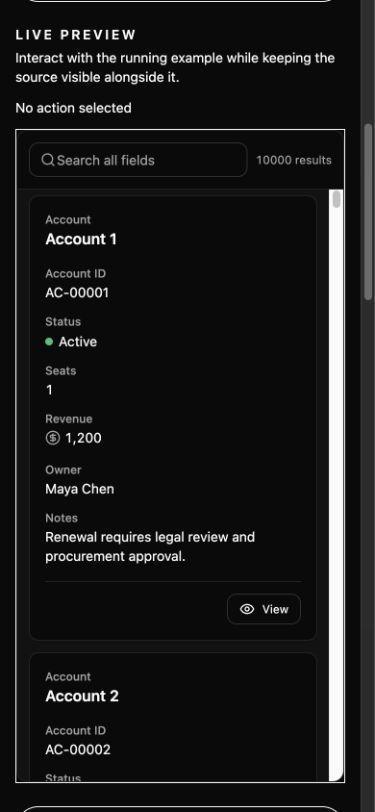
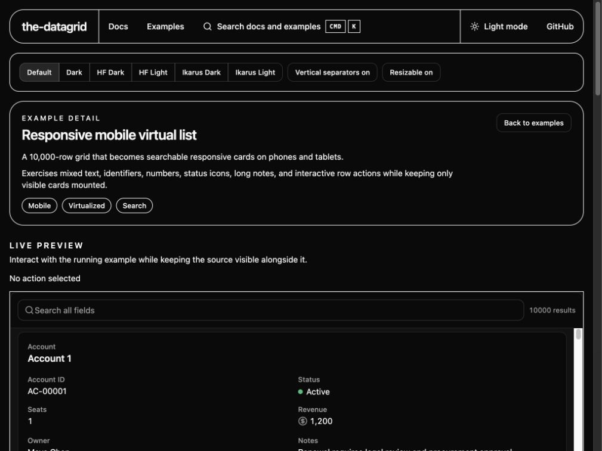

# Mobile transform performance

Measured on 2026-07-09 using headless Chromium on the local development build, at a 390 x 844 viewport. The fixture contains 10,000 rows and eight mixed-content columns. Seven fresh pages were measured; the table reports medians.

Raw run data is available in [`performance.json`](./performance.json).

| Measurement                                   |      Median |
| --------------------------------------------- | ----------: |
| Navigation to interactive mobile list         |      307 ms |
| Two-token global search to one visible result |       35 ms |
| Mounted row cards                             | 7 of 10,000 |
| DOM nodes owned by the grid                   |         328 |

The navigation figure includes Vite development-server work, React mount, construction of the normalized in-memory search cache, and first virtual render. It is not a production bundle benchmark and should be compared only on similar hardware and browser conditions.

## Search design

The grid builds one normalized string per loaded row and performs token-AND substring matching against that cache. Values are Unicode-normalized, case-insensitive, diacritic-insensitive, cycle-safe, and bounded when traversing nested arrays or objects. `useDeferredValue` keeps typing responsive while the scan runs.

Microsoft Docfind was not embedded in the runtime grid. Docfind is optimized for a build-time JSON-to-WASM/FST index, while a DataGrid can receive mutable local rows or remote pages at runtime. Rebuilding and shipping a separate static index would make row updates and remote results inconsistent with the visible data.

## Downsides

- Global search is an O(n) scan and keeps one additional normalized string per loaded row in memory.
- Remote or paginated sources can only search rows currently returned to the client; server-wide search still belongs in the remote `dataSource` implementation.
- Text generated only inside a custom React renderer is not searchable unless its source value also exists in the row data.
- Mobile mode intentionally removes per-column filter controls; existing filter state still applies before the global search.
- Header-driven sort controls are not shown in card mode, although configured/default sort state remains applied.
- Action-column placement uses column ID/header naming conventions; unusually named action columns render as ordinary fields.

## Screenshots

